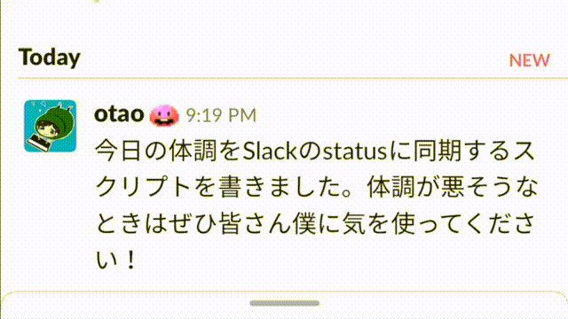

# oura-ring-for-slack-status

Oura Ring で計測されたコンディションスコアを Slack に反映させる GAS スクリプトです。




詳しくは[【Oura Ring】自分の体調を Slack プロフィールに同期した話【GAS】](https://meokz.hatenablog.com/entry/2023/04/11/165920)をご参照ください。

## Install

- Install command line tools

```sh
$ npm install -g @google/clasp
```

- Sign in with Google account

```sh
$ clasp login
```

- Init Project

```sh
$ clasp create --title OuraRingForSlackStatus --type sheets
```

## Deploy

```sh
$ clasp push
```

```sh
$ clasp open
```

## Environments

Please set these parameters as "Script properties".

- OURA_RING_TOKEN
- SLACK_WEBHOOK_URL
- SLACK_USER_OAUTH_TOKEN
